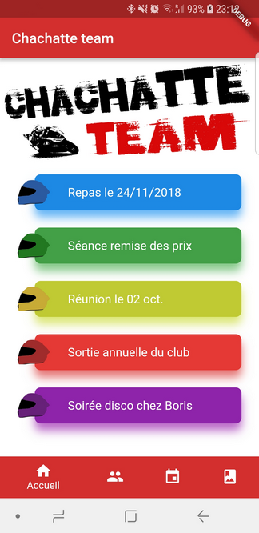

# Chachatte team

Flutter mobile application for the "Chachatte team" motorcycle racing club

# Screenshots

# Usage

You must be an authorized member to use the application.

# Dependencies 

The following packages have been used :
 
- intl: 0.15.7 : for internationalization and localization
- http: 0.12.0 : Future-based library for making HTTP requests
- cupertino_icons: ^0.1.0 : Cupertino icons fonts
- cached_network_image: ^0.5.1 : to load and cache network images
- url_launcher: ^5.0.0 : to open URLs (used for the mailto action)

# Features

The application offers the following features :
- Register club members
- Display member profiles
- Create circuits
- Create events on circuits and identify participants
- Display event calendar
- Add and display photos

# Technical details

The application is connected to an external MariaDB database via REST web services.