# CCTeam Flutter

**Flutter** mobile application for the **CCTeam** motorcycle racing club


---

# Table of Contents

* [About](#about)
* [Installation](#installation)
* [Play Store](#play-store)
* [Usage](#usage)
* [License](#license)

# About

# CCTeam

# Play Store

In build.gradle, upgrade version code and name :

```gradle
versionCode 2
versionName "0.8.0"
```

Build the application bundle :

```bash
flutter build appbundle
```

The **aab** file will be available in _\build\app\outputs\bundle\release\app-release.aab_ directory.

The application is available on the Play Store :


# Screenshots

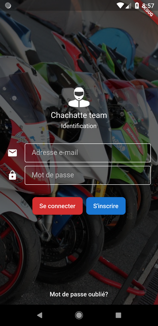
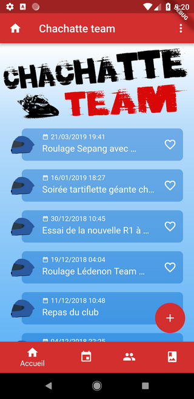
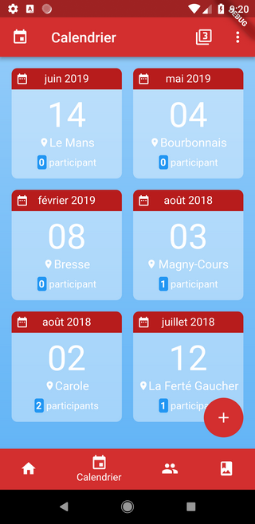
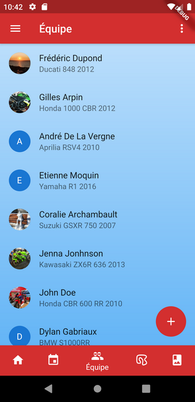
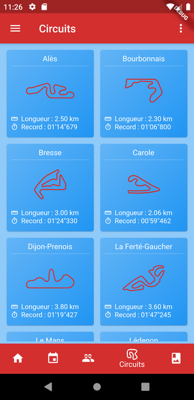
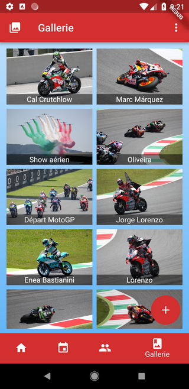

# Usage

## Upgrading Dart

In Intellij, check the version and download new one if necessary, from the menu
_Settings > Languages & Frameworks > Dart_.

Updates the Dart plugin if necessary.

Then modify the SDK version in the _pubspec.yaml_ file accordingly :

```yaml
environment:
  sdk: ^3.7.2
```

To verify :

```bash
dart --version
```

> Dart SDK version: 3.7.2 (stable) (Tue Mar 11 04:27:50 2025 -0700) on "windows_x64"

## Upgrading Flutter

In Intellij, check the version from the menu _Settings > Languages & Frameworks > Flutter_.

Updates the Flutter plugin if necessary.

Then run `flutter upgrade` in the terminal to get the latest stable version of Flutter :

```bash
flutter channel stable
flutter upgrade --force
```

To verify :

```bash
flutter --version
```

> Flutter 3.29.2 • channel stable • https://github.com/flutter/flutter.git<br>
> Engine • revision 18b71d647a<br>
> Tools • Dart 3.7.2 • DevTools 2.42.3

## Upgrading Gradle

> [!WARNING]
> Please pay attention to version compatibility between Gradle and Android Gradle Plugin

From the project's root directory :

```bash
cd android
./gradlew wrapper --gradle-version=8.7
```

This will reload the file _gradle-wrapper.properties_ with the new version of Gradle, specially this line :

```properties
distributionUrl=https\://services.gradle.org/distributions/gradle-8.7-bin.zip
```

For AGP, modify the version in _android/build.gradle_ :

```groovy
dependencies {
  classpath 'com.android.tools.build:gradle:8.6.0'
}
```

Then also change the version in _android/settings.gradle_ :

```groovy
id "com.android.application" version '8.6.0' apply false
```

To verify :

```bash
./gradlew --version
```

> ------------------------------------------------------------<br>
> Gradle 8.7<br>
> ------------------------------------------------------------<br>
> <br>
> Build time:   2024-03-22 15:52:46 UTC<br>
> Revision:     650af14d7653aa949fce5e886e685efc9cf97c10<br>
> <br>
> Kotlin:       1.9.22<br>
> Groovy:       3.0.17<br>
> Ant:          Apache Ant(TM) version 1.10.13 compiled on January 4 2023<br>
> JVM:          17.0.2 (Oracle Corporation 17.0.2+8-86)<br>
> OS:           Windows 11 10.0 amd64<br>

## Upgrading dependencies

To upgrade all project dependencies to their latest versions, run :

```bash
flutter pub upgrade --major-versions
```

## Playstore

You must be an authorized member to use the application.

You must set the `API_BASE_URL` variable when executing the application :

For production :

```bash
flutter run lib/main.dart --dart-define=API_BASE_URL=https://ccteam.rockybox.net/ccteam-gql
```

For connected mobile device :

```bash
flutter run lib/main.dart --dart-define=API_BASE_URL=http://192.168.0.11:5001/ccteam-gql // for
```

For local emulator :

```bash
flutter run lib/main.dart --dart-define=API_BASE_URL=http://10.0.2.2:5000/ccteam-gql // for local emulator
```

# Dependencies

The following packages have been used :

- intl: for internationalization and localization
- http: Future-based library for making HTTP requests
- cupertino_icons: Cupertino icons fonts
- cached_network_image: to load and cache network images
- url_launcher: to open URLs (used for the mailto action)
- shared_preferences: to be able to use shared preferences
- provider : state management pattern
- logging : for logging
- graphql_flutter : for GraphQL API calls

# Features

The application offers the following features :

- Register and login members
- Display member profiles
- Create circuits
- Create events on circuits and identify participants
- Display event calendar
- Add and display photos

# Technical details

## Initialization (on application start)

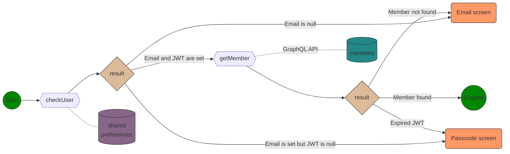

## E-mail screen

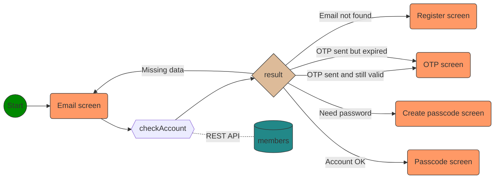

## Register screen

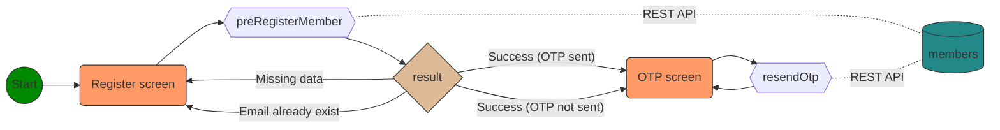

## OTP screen

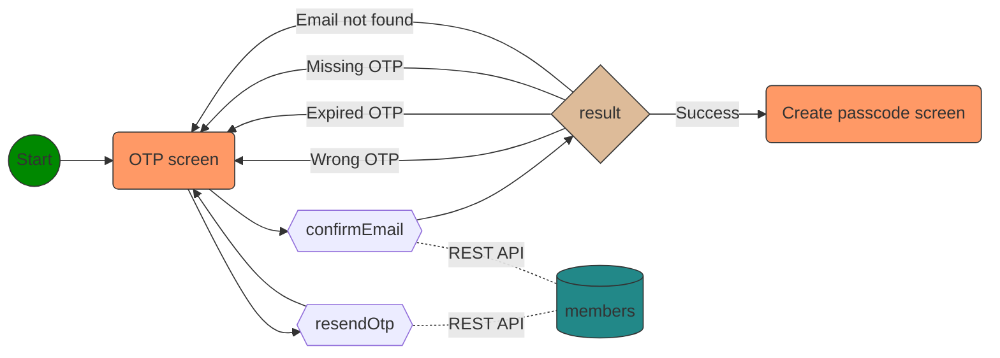

## Create passcode screen

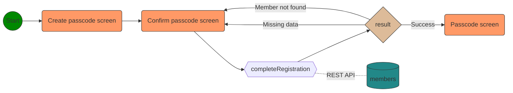

## Passcode screen

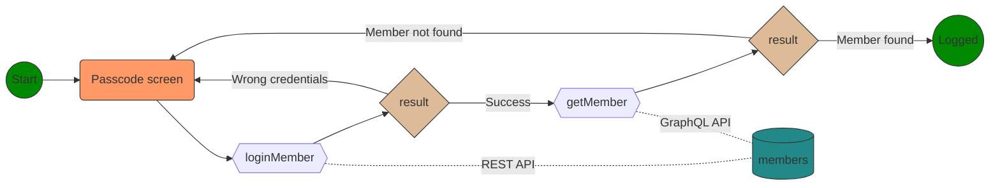

## Misc

The application is connected to an external MariaDB database via REST web services.

Only user e-mail is kept in shared preferences

# License

[General Public License (GPL) v3](https://www.gnu.org/licenses/gpl-3.0.en.html)

This program is free software: you can redistribute it and/or modify it under the terms of the GNU General Public License as published by the Free Software Foundation, either
version 3 of the License, or (at your option) any later version.

This program is distributed in the hope that it will be useful, but WITHOUT ANY WARRANTY; without even the implied warranty of MERCHANTABILITY or FITNESS FOR A PARTICULAR PURPOSE.
See the GNU General Public License for more details.

You should have received a copy of the GNU General Public License along with this program. If not, see <http://www.gnu.org/licenses/>.

# Test

To run integration test :

```
flutter drive --driver=test_driver/integration_test.dart --target=integration_test/login_test.dart
```

# todo

- ajouter link dans Track pour lien vers le site web du circuit
- attention si listes sur différentes pages utilse le meme provider tout est mis à jour ? (genre filtre des evenements)
- liste prédéfinie de motos plus possibilité d'en ajouter
- liste prédéfinie d'organisateurs + possibilité d'en créer
- couleur datepicker
- renvoyer vers page "maintenance" si serveur down