# CCTeam Flutter

**Flutter** mobile application for the **CCTeam** motorcycle racing club


---

# Table of Contents

* [About](#about)
* [Installation](#installation)
* [Usage](#usage)
* [Contributing](#contributing)
* [Data privacy](#data-privacy)
* [AI disclosure](#ai-disclosure)
* [License](#license)

# About

<table>
  <tr>
    <td>
        
    </td>
    <td>
        
    </td>
  </tr>
</table>

CCTeam is a motorcycle racing club that organizes events and activities for motorcycle racing enthusiasts.

The CCTeam Flutter application provides a platform for admins to manage the club, and members to stay updated on club news, events, and activities. 
It also allows members to manage their profiles, bikes, lap records, and organize their riding sessions.

## Features

- **Admin functionalities** (also have member functionalities) :
  - Manage news, events, members and tracks (create / edit / delete).
  - Manage membership status and board roles of members.

- **Member functionalities**:
  - View news, events, members and tracks details (lap records, bike servicing, etc.).
  - Manage their profile (avatar, contact details, etc.).
  - Manage their bikes, including specifications and servicing records.
  - Organize their riding sessions by joining or leaving sessions.
  - Record and manage lap times on different tracks.
  - View statistics and performance metrics.
  - View the photo gallery of the club's events and activities.

## Screenshots

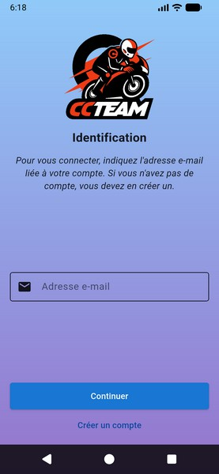

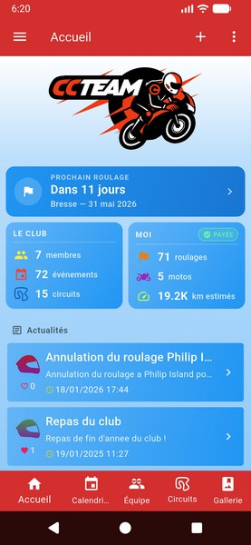
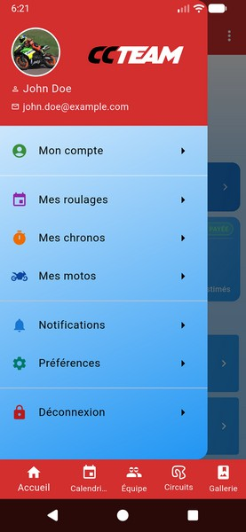
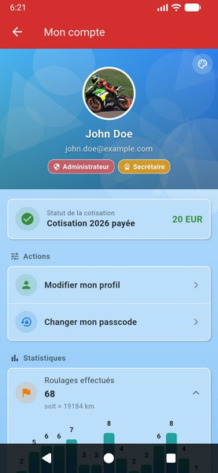
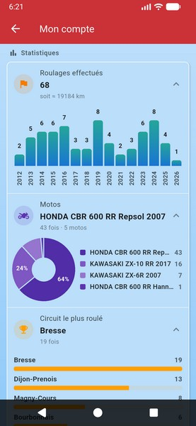
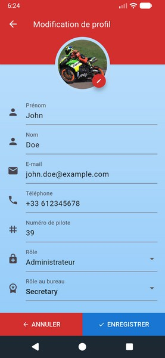
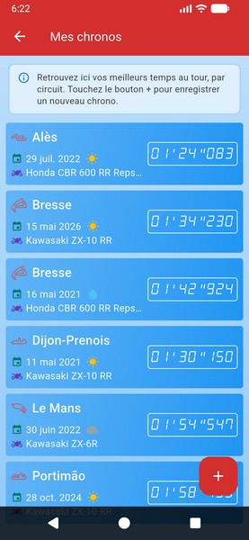
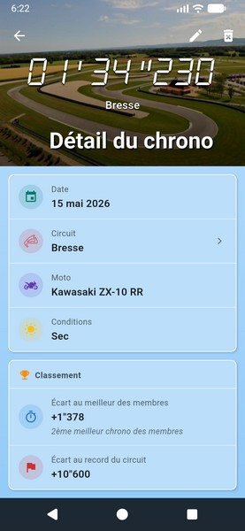
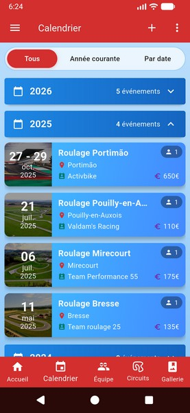
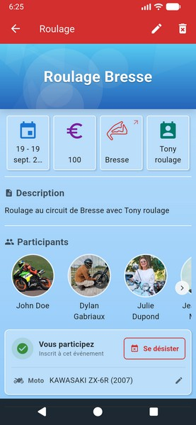
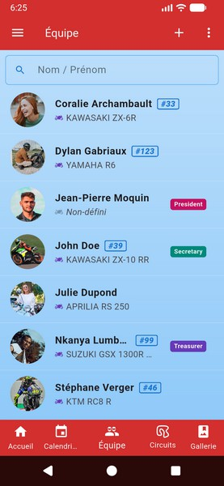
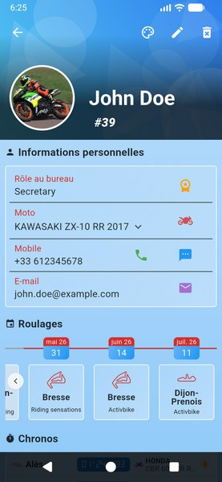
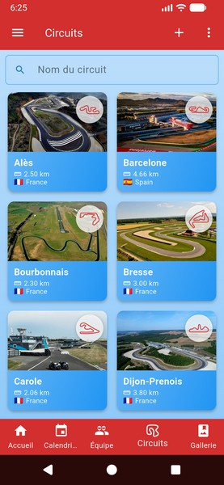
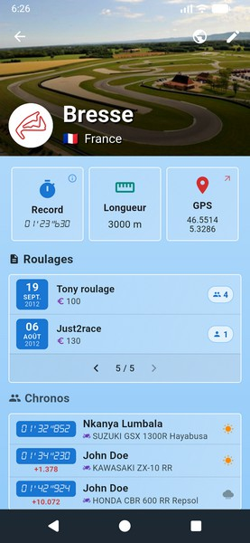
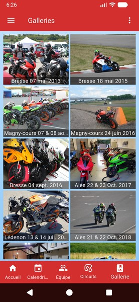

# Installation

To install the application, follow these steps:

1. Clone the project
2. Install the Android SDK on your machine (i.e. command line tools) :
   ```
   sdkmanager --install "platform-tools" "platforms;android-34" "build-tools;34.0.0"
   sdkmanager "emulator" "system-images;android-34;google_apis;x86_64"
   ```
3. Install the flutter SDK on your machine
4. Install the Flutter plugin (Intellij IDE)
5. In the project settings, set the Flutter SDK path (Intellij IDE)
6. Create a _local.properties_ files inside the android folder and set :
   ```properties
    sdk.dir=C:\\android
    flutter.sdk=C:\\flutter
    flutter.buildMode=debug
    ```
7. Run `flutter pub get`
8. Run `gradle app:build`
9. Run the application on an emulator or a physical device, see [Usage](#usage) section.

# Usage

## Install emulator

Install a proper system image and create an emulator :

```bash
sdkmanager "platforms;android-34" "system-images;android-34;google_apis;x86_64" "emulator"
avdmanager create avd -n flutter_x86_64 -k "system-images;android-34;google_apis;x86_64" -d pixel
```

Then start it with:

```bash
emulator -avd flutter_x86_64
```

## Run the backend

The backend is a Spring Boot application that provides a REST and GraphQL APIs for the Flutter application.

You can find the backend source code in the [ccteam-graphql](https://github.com/Yann39/ccteam-graphql) repository,
follow the instructions in the README file to run it.

## Run the app

You must be an authorized member to use the application.

You must set the `API_BASE_URL`, `LYCHEE_BASE_URL` AND `LYCHEE_ROOT_ALBUM_ID` variables when executing the application :

For production :

```bash
flutter run lib/main.dart --dart-define=API_BASE_URL=https://ccteam.example.com/ccteam-gql --dart-define=LYCHEE_BASE_URL=https://lychee.example.com/ --dart-define=LYCHEE_ROOT_ALBUM_ID=xxxxxxxxxx
```

For connected mobile device with local backend :

```bash
flutter run lib/main.dart --dart-define=API_BASE_URL=http://192.168.0.11:5001/ccteam-gql --dart-define=LYCHEE_BASE_URL=https://lychee.example.com/ --dart-define=LYCHEE_ROOT_ALBUM_ID=xxxxxxxxxx
```

For local emulator with local backend :

```bash
flutter run lib/main.dart --dart-define=API_BASE_URL=http://10.0.2.2:5001/ccteam-gql --dart-define=LYCHEE_BASE_URL=https://lychee.example.com/ --dart-define=LYCHEE_ROOT_ALBUM_ID=xxxxxxxxxx
```

To deploy the app in release mode :

```bash
flutter run --release --dart-define=API_BASE_URL=https://ccteam.example.com/ccteam-gql --dart-define=LYCHEE_BASE_URL=https://lychee.example.com/ --dart-define=LYCHEE_ROOT_ALBUM_ID=xxxxxxxxxx
```

# Contributing

If you want to contribute to this repository, please first discuss the change you wish to make via issue, email,
or any other method with the owners.

See [Installation](#installation) and [Usage](#usage) sections to set up the project on your machine
and make sure the [Tests](#tests) are passing.

## Upgrading Dart

In Intellij, check the version and download new one if necessary, from the menu
_Settings > Languages & Frameworks > Dart_.

Updates the Dart plugin if necessary.

Then modify the SDK version in the _pubspec.yaml_ file accordingly :

```yaml
environment:
  sdk: ^3.7.2
```

To verify :

```bash
dart --version
```

> Dart SDK version: 3.7.2 (stable) (Tue Mar 11 04:27:50 2025 -0700) on "windows_x64"

## Upgrading Flutter

In Intellij, check the version from the menu _Settings > Languages & Frameworks > Flutter_.

Updates the Flutter plugin if necessary.

Then run `flutter upgrade` in the terminal to get the latest stable version of Flutter :

```bash
flutter channel stable
flutter upgrade --force
```

To verify :

```bash
flutter --version
```

> Flutter 3.29.2 • channel stable • https://github.com/flutter/flutter.git<br>
> Engine • revision 18b71d647a<br>
> Tools • Dart 3.7.2 • DevTools 2.42.3

## Upgrading Gradle

> [!WARNING]
> Please pay attention to version compatibility between Gradle and Android Gradle Plugin

From the project's root directory :

```bash
cd android
./gradlew wrapper --gradle-version=8.7
```

This will reload the file _gradle-wrapper.properties_ with the new version of Gradle, specially this line :

```properties
distributionUrl=https\://services.gradle.org/distributions/gradle-8.7-bin.zip
```

For AGP, modify the version in _android/build.gradle_ :

```groovy
dependencies {
  classpath 'com.android.tools.build:gradle:8.6.0'
}
```

Then also change the version in _android/settings.gradle_ :

```groovy
id "com.android.application" version '8.6.0' apply false
```

To verify :

```bash
./gradlew --version
```

> ------------------------------------------------------------<br>
> Gradle 8.7<br>
> ------------------------------------------------------------<br>
> <br>
> Build time:   2024-03-22 15:52:46 UTC<br>
> Revision:     650af14d7653aa949fce5e886e685efc9cf97c10<br>
> <br>
> Kotlin:       1.9.22<br>
> Groovy:       3.0.17<br>
> Ant:          Apache Ant(TM) version 1.10.13 compiled on January 4 2023<br>
> JVM:          17.0.2 (Oracle Corporation 17.0.2+8-86)<br>
> OS:           Windows 11 10.0 amd64<br>

## Upgrading dependencies

To upgrade all project dependencies to their latest versions, run :

```bash
flutter pub upgrade --major-versions
```

## Play Store

To publish the app on the Play Store, you need to create a signed APK or AAB file.
You can follow the official Flutter documentation for [building and releasing an Android app](https://flutter.dev/docs/deployment/android).

Once done, on each release, in _pubspec.yaml_, upgrade version code and name
in the format `<versionName>`+`<versionCode>`, i.e. :

```yaml
version: 1.0.1+6
```

This is read by the _build.gradle_ file (drives the Play Store + Android system settings).

> [!info]
> Version code is a monotonically increasing integer required by the Play Store for each upload, bump it per release.

Build the application bundle :

```bash
flutter build appbundle --dart-define=API_BASE_URL=https://ccteam.example.com/ccteam-gql --dart-define=LYCHEE_BASE_URL=https://lychee.example.com/ --dart-define=LYCHEE_ROOT_ALBUM_ID=xxxxxxxxxx
```

> [!important]
> Don't forget to set the API_BASE_URL, LYCHEE_BASE_URL and LYCHEE_ROOT_ALBUM_ID environment variables when building the app for release, otherwise the app won't work properly.

Then, you can upload the generated AAB file to the Google Play Console and follow the instructions to publish your app.

The **aab** file will be available in _\build\app\outputs\bundle\release\app-release.aab_ directory.

## Tests

To run integration tests :

```
flutter drive --driver=test_driver/integration_test.dart --target=integration_test/login_test.dart
```

# Data privacy

The data collected by the application is stored securely in a database and is not shared with any third parties.

Data is stored in Switzerland and is protected by the Swiss Federal Data Protection Act (DPA)
and the Swiss Federal Data Protection Ordinance (DPO).

The only data stored on the device is the user's e-mail, which is used for authentication purposes.

# AI disclosure

Most of this project was built without AI assistance (codebase is from 2019).

I only started using AI recently for a limited set of improvements.

All AI-assisted changes were carefully reviewed before being kept in the codebase.

I can explain every line of code in this project, including the parts where AI was used.
This project was not "vibe coded".

# License

[General Public License (GPL) v3](https://www.gnu.org/licenses/gpl-3.0.en.html)

This program is free software: you can redistribute it and/or modify it under the terms of the GNU General Public License as published by the Free Software Foundation, either
version 3 of the License, or (at your option) any later version.

This program is distributed in the hope that it will be useful, but WITHOUT ANY WARRANTY; without even the implied warranty of MERCHANTABILITY or FITNESS FOR A PARTICULAR PURPOSE.
See the GNU General Public License for more details.

You should have received a copy of the GNU General Public License along with this program. If not, see <http://www.gnu.org/licenses/>.